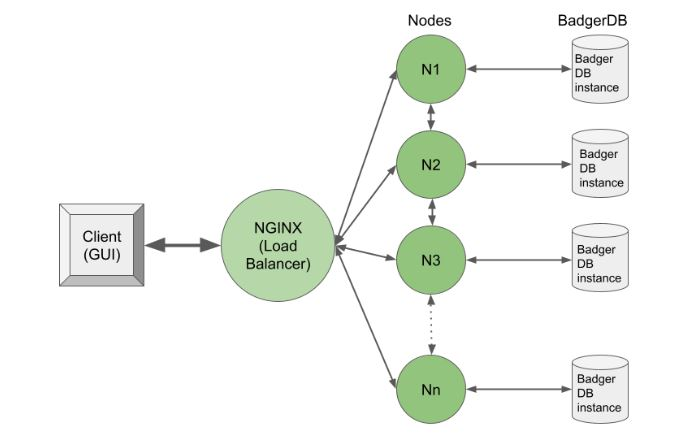

#### 50.041 Distributed Systems and Computing
# Amazon DynamoDB Key-Value Store Clone

**Group Members: Toh Kai Feng, Tan Xin Yi, Amrish Dev Sandhu, Goh Shao Cong Shawn, Lim Jun Wei.**


## Introduction
 With the goal of demonstrating our learning and understanding of core concepts covered in the 50.041 Distributed Systems and Computing course instructed by Professor Sudipta Chattopadhyay at SUTD, this project implementing a key-value distributed storage that is similar to Amazon's DynamoDB while emulating certain features that has contributed to the success of DynamoDB as a commercially available key-value store. Features that we will be implementing include Scalability through joining, Intermittent fault tolerance through hinted handoffs, High write availability through an always-write policy and data versioning control through vector clock implementation. 


## Context

E-commerce is on the rise, fuelled by COVID-19 (Global E-Commerce Jumps to $26.7 Trillion, Fuelled by COVID-19, 2021).

As such, there is a rising need for a highly available data-store to serve the increasing number of online customers. Amazon as a leader in e-commerce has implemented distributed systems solutions that enable their services to be always available (millions of customers can always add an item into their shopping cart at any time even amidst network and server failure) to maintain customer trust. This means reliability on a large scale with highly decentralised, service oriented architecture consisting of hundreds of services. 

With e-commerce platforms becoming increasingly competitive and supply chain shortages occurring around the world, maintaining a system that is ever reliable that allows customers to accurately add and delete items to their cart and see these changes reflected accurately is important to the user experience. Companies have to ensure that their systems are reliable to avoid financial consequences and losing customer trust, and also have to be highly scalable to feed the increased web demand. 

After our exploration of the various project topics, we are inspired to dive deep into the exploration of Amazon’s implementation of the Dynamo solution in its e-commerce platform by designing our own simplified e-commerce cart system that would like to provide availability (highly available writes), reliability (eventual consistency) and scalability (cheaper maintenance).


## System Architecture

<p align = "center">

</p>

Our implementation of a DynamoDB clone mainly consists of the following components arranged in the above configuration:
- **React E-commerce Cart Simulator(GUI)**
    Serving as a proof-of-concept, this react front-end aims to simulate a typical e-commerce cart service whereby clients can add, modify or remove items to and from their cart. This will serve as the interface to interact with the DynamoDB clone, apart from command line manipulation, through the NGINX load balancer using the ```coordinate_api```  and will provide a graphical output to responses to read or write operations through the use of toast messages. 
<table align = "center"><tr><td>

</td></tr></table>

- **NGINX Load Balancer**
    Utilising Nginx, the load balancer acts as the front-facing exposed endpoint for the GUI and is responsible for distributing read and write requests to a random node as a coordinator within the ring structure which would handle the read and write request before contacting the responsible node to perform the read and write request. 
    
    
- **Data Nodes**
    Using the [BadgerDB](https://dgraph.io/docs/badger/) library which allows us to create a persistent store, the data nodes hold dual responsibilities as coordinator nodes and a normal node.
    - As a Coordinator node, the node is responsible for handling requests for the load balancer and  would identify the responsible storage nodes. Before handling write requests, the coordinator would update the data object’s vector clock before passing it to the responsible node.Lastly, the coordinator is also in charge of sending and retrieving hinted replicas.  
    - As a Normal node, it is responsible for reading and writing to its BadgerDB instance or storage. When it receives data objects with conflicting vector clocks, it would also append both versions to storage. Lastly, the node here is in charge of storing hinted replicas assigned by the coordinator and would  periodically attempt to handoff to the intended responsible node. 


## Features
| Principle | Rationale  | Features  |
|---------|------------|------------|
| Scalability | One single server would eventually have insufficient bandwidth and storage. Thus the architecture of our system should be designed to manage incrementally increasing load and storage given rising user traffic.| Consistent hashing  |
| High availability for writes | We want users to view updated carts and items to be added/deleted from their carts even amidst server failures. This would present a site that is “always functioning” and present carts that contained the updated items from the previous session.   | Consistent Hashing, Joining, Hinted Handoff, Replication |
| Consistency / Eventual Consistency | It is important that the data stored in all servers reflect the same changes made by the user so that even viewed on different devices or clients, they are up to date. However, some relaxation to our system’s consistency (allowing for eventual consistency) can be made since higher priority is instead given to our system’s availability. | Data versioning using vector clocks |
| Fault Tolerance (Temporary Failure) | Assuming that temporary failure of machines can occur, we need to design a system that is tolerant of such failures. This improves the availability of the system, and reduces the likelihood of permanent data loss. | Replication, Hinted handoff


## Setup Instructions
### Starting Shopping Cart Web Application
* cd into the ```web-app``` folder and run the command:
``` 
npm run start
``` 

### Starting NGINX Load Balancer 

* cd into the ```nginx``` folder and run the command:
```
./start.sh
```
Note: For detailed setup instructions for Nginx, please refer to the official [Nginx documentation](http://nginx.org/en/docs/).

### Starting Distributed Key-Value Store Backend 
* cd into the ```go-system``` Folder
```
./start.sh
```

#### Manual setup
* cd into the ```go-system/cmd``` Folder
```
go run main.go -id=<id> -port=<port number> -first=<is-first-node>
```
* Example (to start nodes with ids 0, 1, 2): 

```
go run main.go -id=0 -port=8000 -first=true
```
```
go run main.go -id=1 -port=8001
```
```
go run main.go -id=2 -port=8002
```